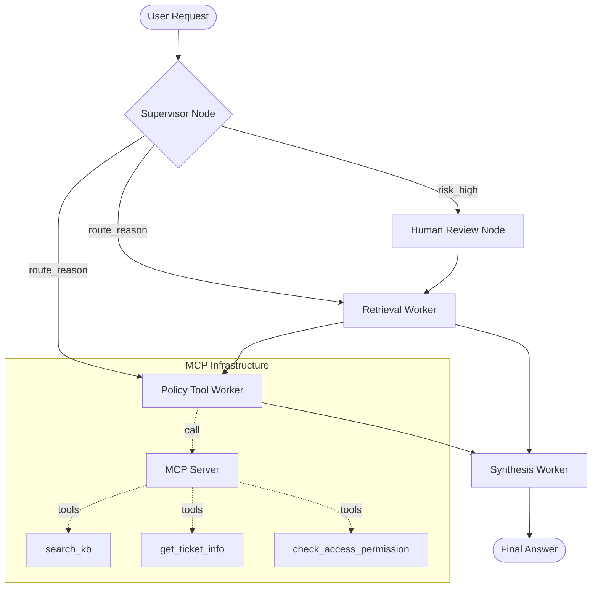

# System Architecture — Lab Day 09

**Nhóm:** 7  
**Ngày:** 14/04/2026  
**Version:** 1.0

---

## 1. Tổng quan kiến trúc

**Pattern đã chọn:** Supervisor-Worker , gồm 3 worker: Retrieval, Policy, Synthesis 
**Lý do chọn pattern này (thay vì single agent):**
1. **Modularity:** Cho phép phát triển và kiểm thử từng worker một cách độc lập.
2. **Control:** Supervisor có thể kiểm soát luồng xử lý, trigger Human-in-the-loop (HITL) cho các case rủi ro cao.
3. **Efficiency:** Chỉ kích hoạt các worker cần thiết và gọi tool chuyên biệt giúp giảm hallucination so với việc để 1 agent làm tất cả.

---

## 2. Sơ đồ Pipeline
**Sơ đồ thực tế của nhóm:**

---

## 3. Vai trò từng thành phần

### Supervisor (`graph.py`)

| Thuộc tính | Mô tả |
|-----------|-------|
| **Nhiệm vụ** | Phân loại task, quyết định worker, xác định rủi ro (risk_high) và nhu cầu dùng tool. |
| **Input** | `task` (câu hỏi từ người dùng) |
| **Output** | `supervisor_route`, `route_reason`, `risk_high`, `needs_tool` |
| **Routing logic** | Keyword matching (policy, SLA, risk) kết hợp Regex cho mã lỗi (ERR-xxx). |
| **HITL condition** | Khi gặp mã lỗi lạ hoặc các từ khóa rủi ro cao (emergency, 2am, contractor). |

### Retrieval Worker (`workers/retrieval.py`)

| Thuộc tính | Mô tả |
|-----------|-------|
| **Nhiệm vụ** | Thực hiện tìm kiếm semantic search trên ChromaDB để lấy evidence. |
| **Embedding model** | `text-embedding-3-small`. |
| **Top-k** | 3 |
| **Stateless?** | Yes |

### Policy Tool Worker (`workers/policy_tool.py`)

| Thuộc tính | Mô tả |
|-----------|-------|
| **Nhiệm vụ** | Phân tích chính sách hoàn tiền/quyền truy cập, gọi MCP tools khi cần. |
| **MCP tools gọi** | `search_kb`, `get_ticket_info`, `check_access_permission`. |
| **Exception cases xử lý** | Flash Sale, Digital products, Activated products, Temporal scoping (v3 vs v4). |

### Synthesis Worker (`workers/synthesis.py`)

| Thuộc tính | Mô tả |
|-----------|-------|
| **LLM model** | `gpt-4o-mini`|
| **Temperature** | 0 |
| **Grounding strategy** | Trích dẫn nguồn trực tiếp sau các nhận định quan trọng. |
| **Abstain condition** | Khi context không chứa thông tin hoặc confidence score quá thấp. |

### MCP Server (`mcp_server.py`)

| Tool | Input | Output |
|------|-------|--------|
| search_kb | query, top_k | chunks, sources |
| get_ticket_info | ticket_id | ticket details (priority, status, SLA) |
| check_access_permission | access_level, requester_role | can_grant, approvers |

---

## 4. Shared State Schema

> Liệt kê các fields trong AgentState và ý nghĩa của từng field.

| Field | Type | Mô tả | Ai đọc/ghi |
|-------|------|-------|-----------|
| task | str | Câu hỏi đầu vào | supervisor đọc |
| supervisor_route | str | Worker được chọn | supervisor ghi |
| route_reason | str | Lý do route | supervisor ghi |
| retrieved_chunks | list | Evidence từ retrieval | retrieval ghi, synthesis đọc |
| policy_result | dict | Kết quả kiểm tra policy | policy_tool ghi, synthesis đọc |
| mcp_tools_used | list | Tool calls đã thực hiện | policy_tool ghi |
| final_answer | str | Câu trả lời cuối | synthesis ghi |
| confidence | float | Mức tin cậy | synthesis ghi |
| history | list | Nhật ký các bước xử lý | all workers ghi |

---

## 5. Lý do chọn Supervisor-Worker so với Single Agent (Day 08)

| Tiêu chí | Single Agent (Day 08) | Supervisor-Worker (Day 09) |
|----------|----------------------|--------------------------|
| Debug khi sai | Khó — không rõ lỗi ở đâu | Dễ hơn — test từng worker độc lập qua trace |
| Thêm capability mới | Phải sửa toàn prompt | Thêm worker/MCP tool riêng biệt |
| Routing visibility | Không có | Có route_reason và worker_io_logs chi tiết |
| HITL support | Rất khó thực hiện | Sẵn sàng với human_review node |

**Nhóm điền thêm quan sát từ thực tế lab:**

- Supervisor-Worker giúp phát hiện các ca "rủi ro cao" (risk_high) rất nhanh nhờ bộ keyword.
- Việc tách biệt Retrieval và Policy giúp logic phân tích policy ổn định hơn, không bị nhiễu bởi các thông tin retrieval không liên quan.

---

## 6. Giới hạn và điểm cần cải tiến

1. Phụ thuộc nhiều vào chất lượng keyword của Supervisor; nếu user hỏi quá mập mờ có thể route sai.
2. Latency cao hơn do phải qua nhiều bước LLM calls (Supervisor -> Worker -> Synthesis).
3. Đòi hỏi state management chặt chẽ để dữ liệu không bị ghi đè lung tung giữa các workers.
